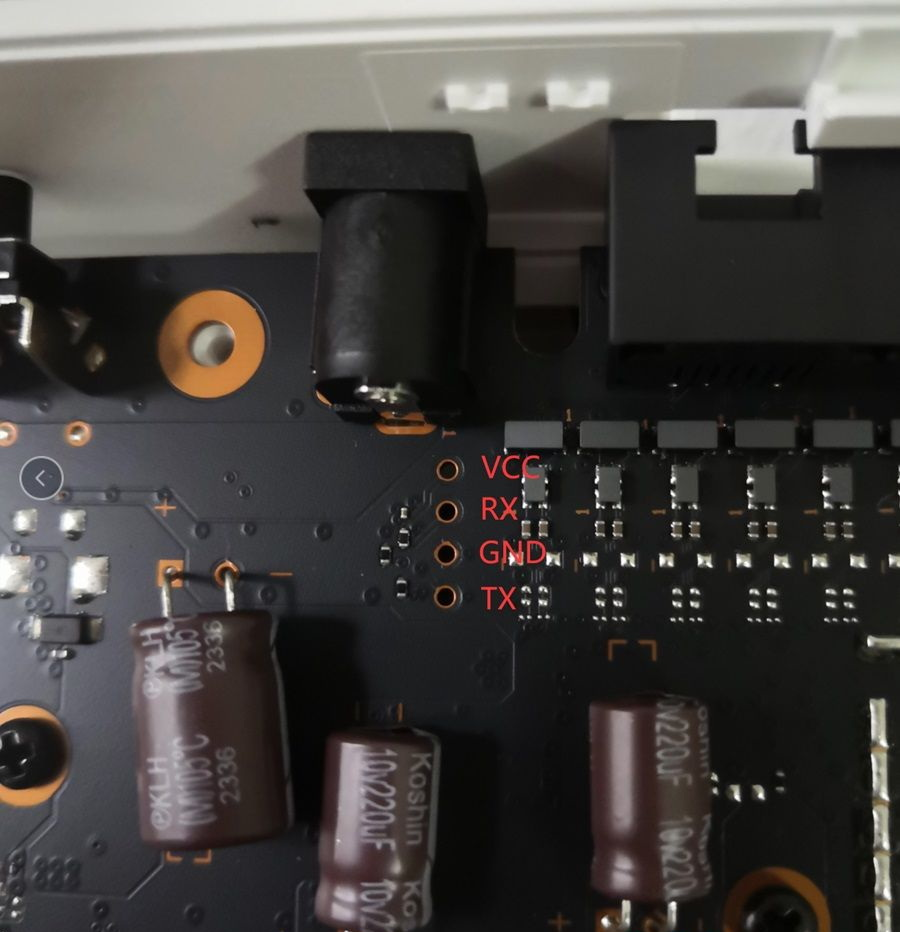
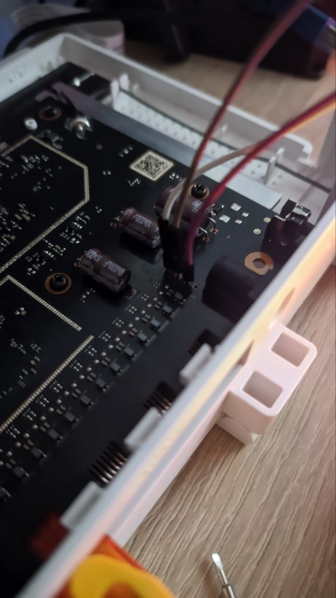
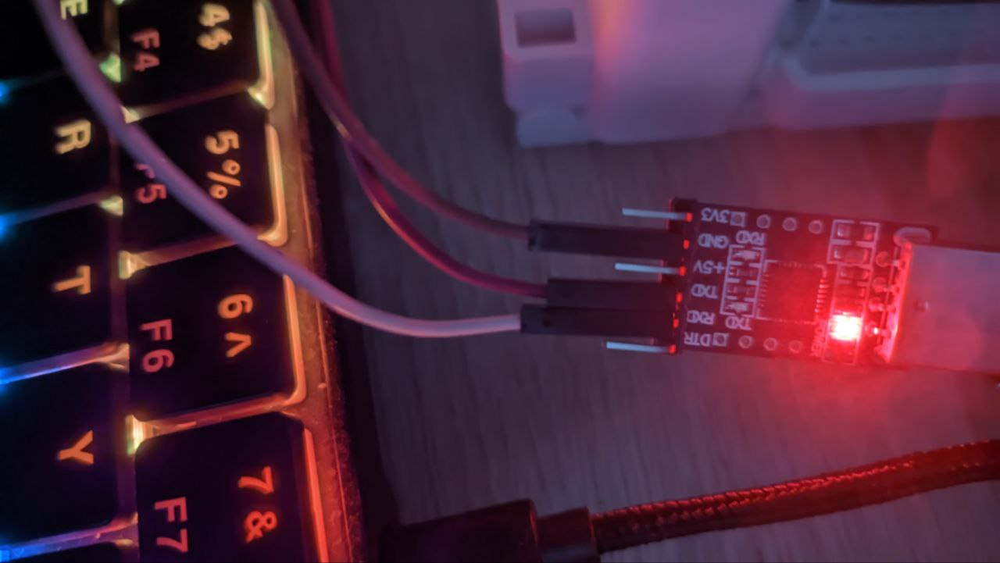

# AX3000T OpenWRT

Just an installation guide in case I forget


**Official guide is here: https://openwrt.org/inbox/toh/xiaomi/ax3000t**

**Downloads: https://downloads.openwrt.org/releases/23.05.5/targets/mediatek/filogic**


## Hacking stock fw

Go to your router web ui (default one is on http://192.168.31.1/) and login.

Then, copy the `stok` string from browser's URI, should be something like this: http://192.168.31.1/cgi-bin/luci/;stok=e6ea114ba2cddb0c70fbbc417bb2706c[...] and we want `e6ea114ba2cddb0c70fbbc417bb2706c` here.

And run `ssh_exploit.sh` file. To do so, you need to have `curl` installed.

Example:
```
./ssh_exploit.sh 192.168.31.1 e6ea114ba2cddb0c70fbbc417bb2706c
```

## Flashing bricked router

Ya, I did brick it xD. Disassemble your router so u can access the mainboard.

**We need those pins:**



To connect, I've used some random serial-to-USB module. You can use  Raspberry Pi as well.

**My setup:**





Now, flash uartboot. Go to `mtk` dir and execute `./flash_uartboot.sh`. If script cannot connect to serial, unplug and plug in the router. It can take a couple of minutes.

Once flashed, we now have cool bootloader.
Unplug the router, run `serial.sh` and plug it back. I've been using `cu` with baud rate set to `115200`.
During boot, there will be a cool boot menu. Click any key to abort default boot (our router is still bricked tho, will not boot properly).


## TFTP

Once we have a cool bootloader, we now want to flash via TFTP method.

On Fedora (40), I installed `tftp-server` via `dnf` package manager and used system service for serving files.

**Make sure tftp server is running:**
```
sudo systemctl start tftp
sudo ss -tulpn | grep 69
```
also, make sure you're not blocked by `firewalld`!


files are inside `/var/lib/tftpboot` directory. Place all files there, and to avoid problems, `sudo chmod -R 777 /var/lib/tftpboot`

Now connect your router and computer via ethernet cable and set static IP address so devices can connect to each other.

Boot openwrt from RAM, and then follow OpenWRT guides
